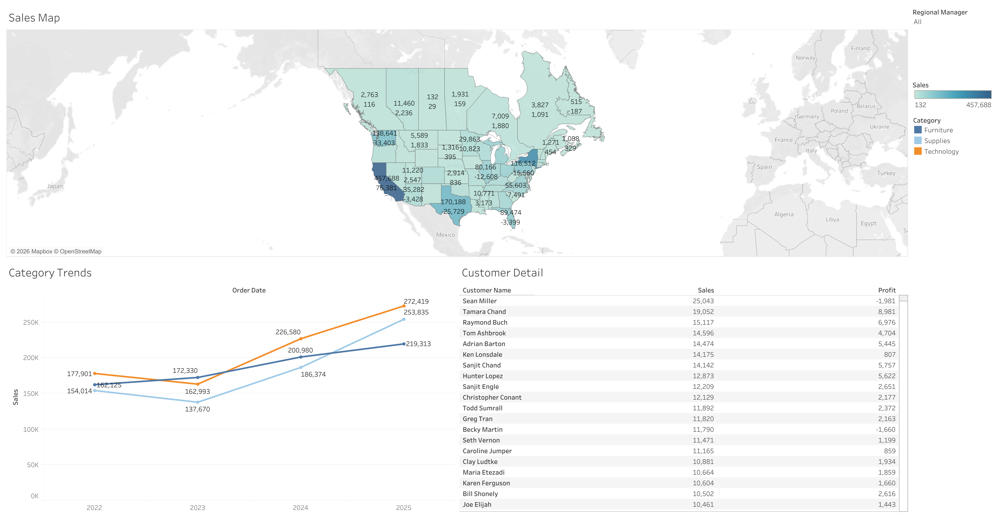
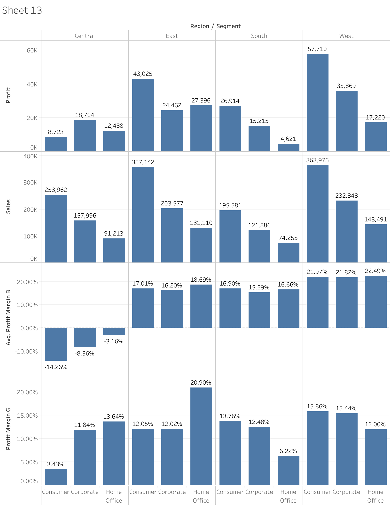
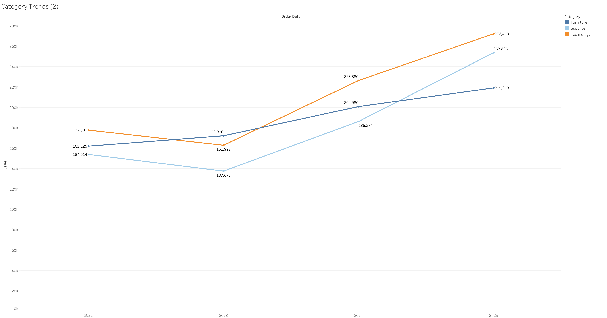

# Tableau Sales Dashboard

Interactive Tableau dashboards focused on executive reporting, regional sales analysis, profitability monitoring, customer insights, and business performance visualization.

This project demonstrates the use of Tableau for building executive-level business intelligence dashboards that support data-driven decision-making through KPI reporting, geographic analysis, trend analysis, and interactive visual storytelling.

---

# Project Overview

This repository contains multiple Tableau dashboards and visualizations analyzing:
- sales performance
- profit trends
- customer behavior
- regional analysis
- category performance
- operational metrics
- profitability ratios

The dashboards were developed to simulate executive business reporting environments commonly used in sales, operations, and management analytics.

---

# Tools & Technologies

- Tableau
- Microsoft Excel
- CSV Data Processing
- Data Visualization
- Business Intelligence Reporting
- Dashboard Design
- KPI Monitoring
- Geographic Mapping
- Trend Analysis

---

# Analytical Focus Areas

- Executive KPI dashboards
- Regional sales analysis
- Profitability analysis
- Customer analytics
- Category trend analysis
- Geographic performance analysis
- Comparative business reporting
- Interactive dashboard reporting

---

# Dashboard Components

## Executive Metric Dashboard

The executive dashboard provides a high-level overview of organizational performance through:
- KPI cards
- regional heatmaps
- state-level hotspot analysis
- customer performance reporting
- profitability monitoring

Key KPIs include:
- Customers
- Orders
- Sales
- Profit
- Profit Ratio
- Average Unit Price

### Dashboard Preview


---

## Sales Map Dashboard

Interactive geographic dashboard visualizing:
- state-level sales distribution
- regional sales performance
- category-level comparisons
- profit concentration

### Dashboard Preview



---

# Supporting Visualizations

## Regional Sales vs Profit Comparison

This dual-axis visualization compares sales and profit performance across business regions to identify high-performing and underperforming operational areas.


---

## Category Sales Comparison

Comparative category analysis highlighting sales performance across:
- Furniture
- Supplies
- Technology


---

## Regional Segment Analysis

Regional segmentation dashboard analyzing:
- sales
- profit
- average profit margins
- customer segments

The dashboard supports comparative operational analysis across multiple business regions.



---

## Category Trend Analysis

Trend analysis dashboard tracking category sales growth over time to identify performance patterns and sales movement trends.



---

# Key Insights

- West and East regions demonstrated the strongest overall sales performance.
- Technology categories showed strong upward sales growth trends over time.
- Regional profitability varied significantly across customer segments.
- Geographic dashboards improved visibility into state-level sales concentration and operational hotspots.
- Executive KPI dashboards support faster business performance monitoring and reporting.

---

# Repository Structure

```text
Tableau-Sales-Dashboard/
│
├── Data/
│   ├── 2026-Tableau-Hands-On.xlsx
│   ├── 2026-Traffic Accidents.csv
│   └── README.md
│
├── Dashboards/
│   ├── SS Dashboard.png
│   └── Dashboard.png
│
├── Tables/
│   ├── Dual Axis.png
│   ├── More Sales.png
│   ├── Region.png
│   └── Sales.png
│
├── Reports/
│   └── Tableau_Sales_Dashboard.pdf
│
└── README.md
```

---

# Files

| File | Description |
|------|-------------|
| `Data/2026-Tableau-Hands-On.xlsx` | Primary Tableau sales and business reporting dataset |
| `Data/2026-Traffic Accidents.csv` | Geographic and analytical dataset used for visualization exercises |
| `Dashboards/SS Dashboard.png` | Executive KPI dashboard |
| `Dashboards/Dashboard.png` | Geographic sales analysis dashboard |
| `Tables/Dual Axis.png` | Sales vs profit regional comparison |
| `Tables/More Sales.png` | Category sales comparison visualization |
| `Tables/Region.png` | Regional segmentation dashboard |
| `Tables/Sales.png` | Category trend analysis visualization |
| `Reports/Tableau_Sales_Dashboard.pdf` | Exported Tableau dashboard report |

---

# Data

This project uses structured business reporting and analytical datasets in Excel and CSV format to support dashboard development and business intelligence reporting.

The datasets were used to analyze:
- sales performance
- regional profitability
- customer activity
- category performance
- operational trends
- geographic analysis

---

# Skills Demonstrated

- Tableau dashboard development
- Executive KPI reporting
- Business intelligence visualization
- Geographic analysis
- Interactive dashboard design
- Comparative analysis
- Trend analysis
- Data storytelling

---

# Author

Cameron Batts

GitHub: https://github.com/Cameron-Batts

Portfolio: https://cameron-batts.github.io

